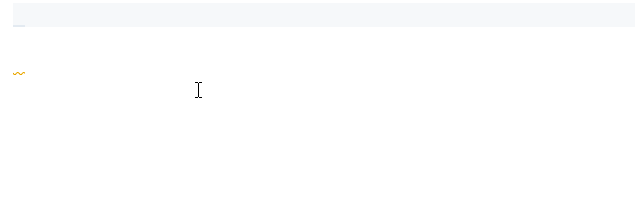

<h1 align="center">
  <br>
    
  <br>
	<br>
  Markdown Snippets
  <br>
  <br>
</h1>
<h4 align="center">Extended Markdown snippets.</h4>

<p align="center">


<a href="https://ko-fi.com/roboleary"></a>
</p>



## Activation

The snippets are only active in Markdown files (defined by `markdown` [language identifier](https://code.visualstudio.com/docs/languages/identifiers)).

## Snippets

| Name                   | Prefix        | Body                                                                                                                      |
|------------------------|---------------|---------------------------------------------------------------------------------------------------------------------------|
| Insert table           | table         | Insert a table with 2 rows and 3 columns. You can tab through each cell   to edit the text.                               |
| Insert 2x1 table       | 2x1table      | Insert a table with 2 rows and 1 column. You can tab through each cell to   edit the text.                                |
| Insert 3x1 table       | 3x1table      | Insert a table with 3 rows and 1 column. You can tab through each cell to   edit the text.                                |
| Insert 4x1 table       | 4x1table      | Insert a table with 4 rows and 1 column. You can tab through each cell to   edit the text.                                |
| Insert 5x1 table       | 5x1table      | Insert a table with 5 rows and 1 column. You can tab through each cell to   edit the text.                                |
| Insert 2x2 table       | 2x2table      | Insert a table with 2 rows and 2 columns. You can tab through each cell   to edit the text.                               |
| Insert 3x2 table       | 3x2table      | Insert a table with 3 rows and 2 columns. You can tab through each cell   to edit the text.                               |
| Insert 4x2 table       | 4x2table      | Insert a table with 4 rows and 2 columns. You can tab through each cell   to edit the text.                               |
| Insert 5x2 table       | 5x2table      | Insert a table with 5 rows and 2 columns. You can tab through each cell   to edit the text.                               |
| Insert 2x3 table       | 2x3table      | Insert a table with 2 rows and 3 columns. You can tab through each cell   to edit the text.                               |
| Insert 3x3 table       | 3x3table      | Insert a table with 3 rows and 3 columns. You can tab through each cell   to edit the text.                               |
| Insert 4x4 table       | 4x3table      | Insert a table with 4 rows and 3 columns. You can tab through each cell   to edit the text.                               |
| Insert 5x5 table       | 5x5table      | Insert a table with 5 rows and 5 columns. You can tab through each cell   to edit the text.                               |
| Insert task list       | task     | Insert  a task list with 1 task.   You can tab through item to set the status (complete/incomplete) and edit the   text. |
| Insert task list 2     | task2   | Insert  a task list with 2 tasks.   You can tab through item to set the status (complete/incomplete) and edit the   text. |
| Insert task list 3     | task3   | Insert  a task list with 3 tasks.   You can tab through item to set the status (complete/incomplete) and edit the   text. |
| Insert task list 4     | task4   | Insert  a task list with 4 tasks.   You can tab through item to set the status (complete/incomplete) and edit the   text. |
| Insert task list 5     | task5   | Insert  a task list with 5 tasks.   You can tab through item to set the status (complete/incomplete) and edit the   text. |

You can install the [Snippets Ranger extension](https://marketplace.visualstudio.com/items?itemName=robole.snippets-ranger) to view this list inside VS Code.

## Installation

1. The extension is listed in the [VS Code Marketplace](https://marketplace.visualstudio.com/items?itemName=robole.markdown-snippets) and [Open VSX Marketplace](https://open-vsx.org/extension/robole/markdown-snippets) where you can download or install it directly.
1. From the Command-line: Run the command `code --install-extension robole.markdown-snippets`.

## FAQ

### 1) Where do the standard markdown snippets come from?

There is a set of snippets for the standard markdown syntax installed with VS Code as part of the built-in markdown extension. [This is the source file](https://github.com/microsoft/vscode/blob/94c9ea46838a9a619aeafb7e8afd1170c967bb55/extensions/markdown-basics/snippets/markdown.code-snippets).

I recommend installing the [Snippets Ranger extension](https://marketplace.visualstudio.com/items?itemName=robole.snippets-ranger) if you want a simple way to view the built-in snippets.

### 2) How do I use the snippets?

To insert a snippet, you can just type one of the prefixes in a markdown file, and you will be offered a completion suggestion. The setting `Editor: Snippet Suggestions` controls whether snippets are shown with other suggestions and how they are sorted. By default, they are shown inline.

Alternatively, you can open the Command Palette (`Ctrl+Shift+P`) and run the command "Insert Snippet", which presents you with a list to choose from.

### 3) How do I add shortcuts for these snippets?

Run the command `Preferences: Open Keyboard Shortcuts (JSON)` to open the keyboard shortcuts config (*keybindings.json*). Add an new object to the array such as this:

```JSON
[

	{
		"key": "ctrl+t",
		"mac": "cmd+t",
		"command": "editor.action.insertSnippet",
		"when": "!editorReadonly && editorLangId == markdown",
		"args": {
			"langId": "markdown",
			"name": "Insert task list"
		}
	}

]
```

The `args.name` property <u>must exactly match</u> the snippet name.

I created the [Markdown Shortcuts extension](https://marketplace.visualstudio.com/items?itemName=robole.markdown-shortcuts) to provide shortcuts for all markdown snippets if this is something you want. You can override my selections if you want, read the extension README for more info.

### 4) Where can I learn more about snippets?

You can read my comprehensive guide on Snippets on FreeCodeCamp: [Visual Studio Code Snippets – the Definitive VS Code Snippet Guide for Beginners](https://www.freecodecamp.org/news/definitive-guide-to-snippets-visual-studio-code/). It's not just for beginners! 😉

### 5) Where can I learn more about keyboard shortcuts?

You can read my article - [VS Code keyboard-fu: custom keyboard shortcuts that will boost your productivity](https://www.roboleary.net/2022/02/28/vscode-keyboard-fu-custom-keyboard-shortcuts.html).

## Show gratitude

If you are happy with the extension, please star the repo, and leave a review to help others find it. 🌟

You can [buy me a coffee](https://ko-fi.com/roboleary) if you would like to enable me to make more great open-source software and tutorials. ☕🙏
